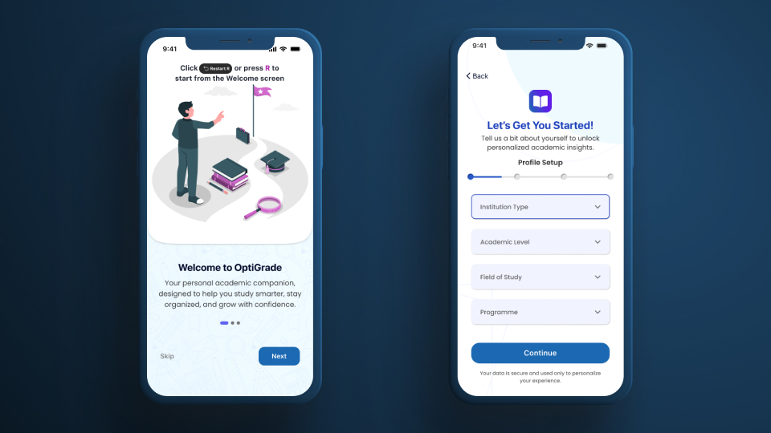
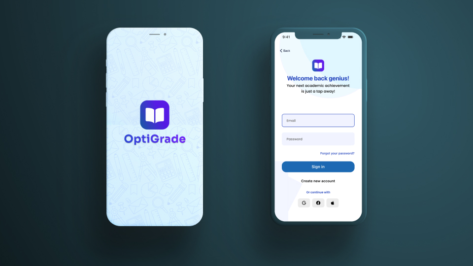
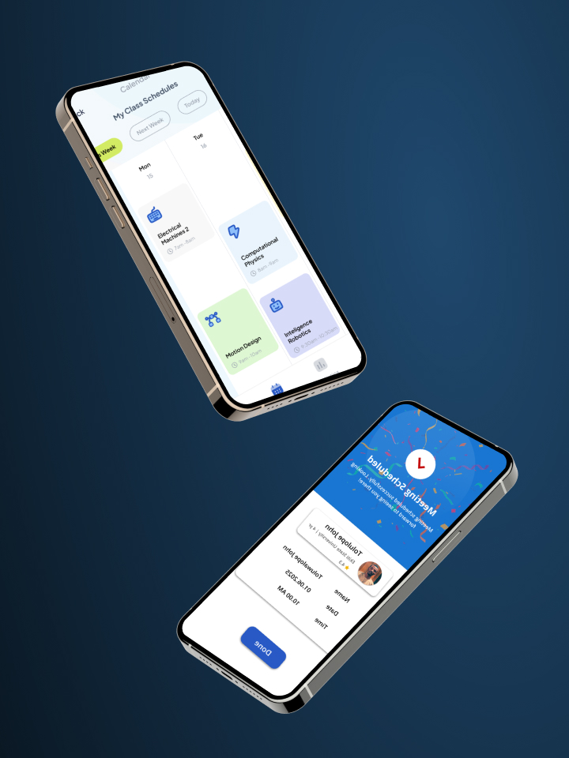

# Portfolio – Toluwalope John

## 🚀 Overview

Welcome to my digital garden! Does a handshake still count if it's digital? This portfolio is a curated showcase of my journey as a **Designer, Analyst, Automation Specialist, AI-Software developer and Creative Technologist**. It reflects my passion for crafting intuitive user experiences, building data-driven solutions, and bridging the gap between design and engineering.

Built with **Next.js** and the **Once UI** design system, this site is designed to be fast, accessible, and visually engaging.

## ✨ Features

- **Dynamic Project Showcase**: Browse my latest work, including **Optigrade**, **Zoe Tech Hub**, and more.
- **Tech Stack Ticker**: A live view of the tools and technologies I use daily (Figma, React, Python, etc.).
- **Interactive Gallery**: A sneak peek into my visual world.
- **Blog & Insights**: Thoughts on design, technology, and the future of ed-tech.
- **Responsive Design**: optimized for every screen size.

## 🛠️ Tech Stack

- **Framework**: [Next.js 15](https://nextjs.org/) (App Router)
- **Styling**: [Once UI](https://once-ui.com/) + SCSS Modules
- **Content**: MDX
- **Deployment**: Vercel

## 📸 Gallery

  
  
  

## 📫 Connect with Me

- **Email**: [oluwalowojohn@gmail.com](mailto:oluwalowojohn@gmail.com)
- **LinkedIn**: [Oluwalowo John](https://www.linkedin.com/oluwalowojohn/)
- **Facebook**: [Oluwalowo John](https://www.facebook.com/oluwalowojohn/)
- **Instagram**: [Oluwalowo John](https://www.instagram.com/oluwalowojohn/)
- **GitHub**: [CryptoLab-service](https://github.com/cryptoLab-service)
- **X**: [@EncryptedMFI](https://twitter.com/EncryptedMFI)

---

> *"Where design, intelligence, and impact ignite."*